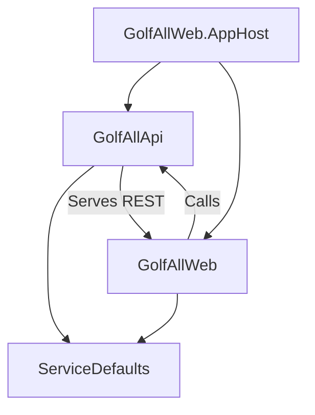

# Solution Overview: GolfAll Aspire Solution

## Overview
GolfAll es una solución .NET Aspire que coordina un frontend Razor Pages y una API REST usando un AppHost que orquesta dependencias y orden de arranque.

## Arquitectura
Proyectos principales:
- GolfAllWeb.AppHost (Aspire Host) – Orquestación, referencias y espera a la API.
- GolfAllApi – API REST con Swagger, CORS y controladores.
- GolfAllWeb – Frontend Razor Pages con ServiceDefaults.
- GolfAllWeb.ServiceDefaults – Configuración compartida (telemetría, resiliencia, descubrimiento).

### Diagrama (Mermaid)

## Componentes Detalle
- AppHost: Define proyectos apiservice y webfrontend; web WaitFor(apiService); expone endpoints externos.
- Api: Controllers + Swagger + CORS (origins https://localhost:7206, http://localhost:5274) + RazorPages (para compatibilidad). Usa HTTPS redirection y estática.
- Web: Razor Pages + ServiceDefaults (telemetría e integraciones Aspire). Static assets mapeados.
- ServiceDefaults: Instrumentación OpenTelemetry, health checks y patrones cross-cutting (implícito por AddServiceDefaults()).

## Interacciones
- Web → API: llamadas HTTP a endpoints REST.
- Ambos (API y Web) → ServiceDefaults: telemetría y configuración.
- AppHost controla orden: Web espera a API antes de considerarse listo.

## Screenshots
(Generar/actualizar ejecutando pruebas Playwright cuando el host esté levantado.)
- Aspire Dashboard: 
- Frontend: 

## Actualización Automática
1. Arrancar AppHost.
2. Ejecutar: `npx playwright test tests/playwright-dashboard-screenshots.spec.js`.
3. Validar Mermaid: `python validate_mermaid.py`.

---
Archivo generado automáticamente (Mermaid + placeholders de capturas).
